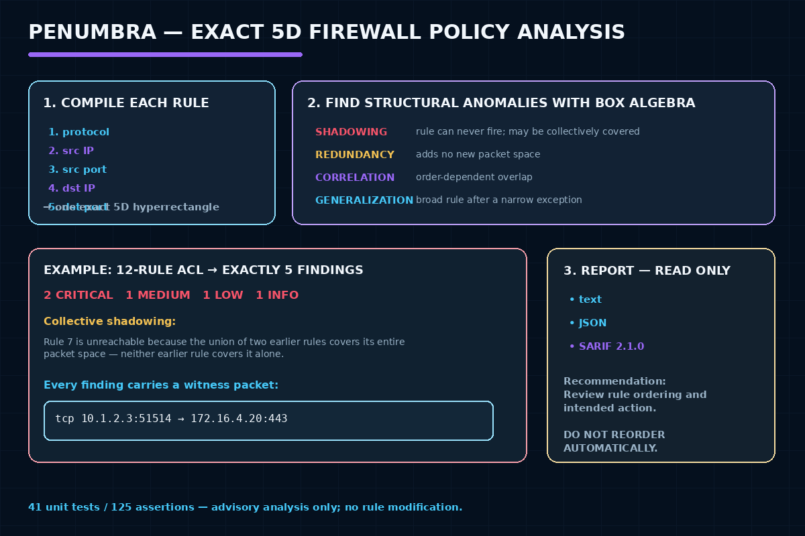

# Penumbra — Firewall Ruleset Anomaly Analyzer


*Ships as the `fwlint` CLI/library — see below.*


This started as an early, simpler version (a rule-matching packet simulator)
and has since been rebuilt into **fwlint**, an offline static analyzer for
firewall rulesets. The original original program is preserved unmodified
under [`archive/original/`](archive/original/) — nothing
about the original version was deleted.

## Overview

fwlint is a native C++ CLI that reads a firewall ruleset (a real Cisco
IOS/IOS XE extended ACL, or a small canonical JSON format) and reports
**anomalies in the ruleset itself** — rules that can never fire, rules that
add nothing new, and rules whose behavior silently depends on evaluation
order — using the same taxonomy that commercial firewall-audit tools
(AlgoSec, Tufin, FireMon) and the academic literature use:

- **Shadowing** — a rule (or the *combination* of several earlier rules) makes
  a later rule completely unreachable, at least one of them with a
  conflicting action. Critical: this is almost always an unintended bug.
- **Redundancy** — a rule adds nothing: earlier same-action rule(s) already
  decide all of its traffic.
- **Correlation** — two rules partially overlap with conflicting actions;
  which one "wins" for the overlapping traffic depends on rule order.
- **Generalization** — a broad rule follows a narrower, conflicting-action
  rule (a specific exception before a general default) — usually
  intentional, flagged as a warning rather than an error.

It also includes a `simulate` command that evaluates one concrete packet
against the ruleset using first-match-wins semantics, for debugging and as
a way to double-check an analysis finding by hand.

## Problem Statement

The original assignment demonstrated ordered rule evaluation with a
first-match-wins packet simulator. That is a fine demonstration of parsing
and control flow, but it isn't something anyone would actually reach for —
plenty of tools evaluate a packet against a rule list. The genuinely useful,
harder problem is auditing the *ruleset itself* before it ships: catching
the rule that can never fire, or the deny rule silently defeated by an
earlier allow. That's what fwlint does.

## Design decisions

**Why not CUDD/BDDs?** The standard technique for exact, whole-policy
firewall analysis (used by FIREMAN and Batfish) represents each rule's
match space as a Binary Decision Diagram and does set algebra over it. This
project's build environment has no package manager capable of building
CUDD or Sylvan against its only available compiler (MinGW g++ — no MSVC is
installed, and neither BDD library has a prebuilt vcpkg port). Rather than
gamble on a fragile cross-compiled native dependency, fwlint implements
**exact axis-aligned box decomposition** instead: every rule compiles to
one 5-dimensional hyperrectangle (protocol × source IP × source port ×
destination IP × destination port), and set operations (union, intersection,
difference, subset, witness extraction) are computed by splitting boxes
along each dimension exactly where they partially overlap. This is *not* an
approximation — it produces the same set-theoretically exact answer a BDD
would — and it's also a published, peer-reviewed technique in its own
right: Hu, Ahn & Kulkarni's 2012 paper on firewall policy anomaly detection
uses **rule-space segmentation** for exactly this reason. The trade-off is
performance on very large rulesets (a BDD stays compact under much heavier
overlap; box lists can grow combinatorially) — see "Performance" below for
real measured numbers rather than a guess.

**Why Cisco extended ACLs, and why only a subset?** A custom rule-file
format is not something anyone can paste a real config into. Cisco extended
IPv4 ACLs are a genuine, widely-used vendor syntax that maps almost exactly
onto the 5-tuple model the analysis engine already needs. Supporting *all*
of Cisco ACL syntax (object-groups, reflexive rules, discontiguous wildcard
masks, `established`, precedence/tos/time-range qualifiers) — let alone
`iptables`/`nftables`, which add chains, jumps, and connection-tracking
state that turn a rule list into a control-flow graph — is a much larger
and riskier undertaking: a half-correct parser that silently ignores a
qualifier it doesn't understand could tell you a policy is clean when it
isn't. fwlint instead supports a **deliberately bounded, well-tested
subset** (see `include/fwlint/parser_cisco.h`) and **fails closed**: any
line outside that subset is a hard parse error with the offending line
number, never a silently-ignored token. iptables/nftables support is listed
under Future Enhancements, not implemented as a partial/unsafe stand-in.

**Why box-decomposition and not just pairwise rule comparison?** A purely
pairwise anomaly checker (compare rule *i* to rule *j*, one pair at a time)
misses the case where several earlier rules *together* make a later rule
unreachable even though no single earlier rule does alone. Tufin, AlgoSec,
and FireMon's own documentation defines shadowing in terms of "a rule or
**combination** of higher-priority rules" for exactly this reason. fwlint's
whole-policy reachability tracking (`analyze_policy` in
[`src/analysis.cpp`](src/analysis.cpp)) catches this "collective shadowing"
case; see the worked example below.

## Tools and Technologies

- C++20, built with CMake + MinGW g++ (no IDE-specific project files)
- [nlohmann/json](https://github.com/nlohmann/json) for canonical-JSON
  parsing and JSON/SARIF output (via vcpkg)
- [Catch2 v3](https://github.com/catchorg/Catch2) for the unit test suite
  (via vcpkg)
- Statically linked on Windows/MinGW — the built `fwlint.exe` depends only
  on `KERNEL32.dll` and the Universal CRT, no MinGW runtime DLLs to ship

## Features

- **Four canonical anomaly checks** (shadowing, redundancy, correlation,
  generalization) plus **collective shadowing** (domination by a
  *combination* of earlier rules).
- **Witness packets** — every finding includes one concrete packet
  (protocol/IPs/ports) that demonstrates it, generated directly from the
  exact packet-space representation, not fabricated after the fact.
- **Two real input formats**: a canonical JSON policy format, and a real
  (bounded-subset) Cisco IOS/IOS XE extended ACL parser.
- **Three output formats**: human-readable text, structured JSON, and a
  minimal valid SARIF 2.1.0 log (for GitHub code-scanning / CI integration).
- **`simulate` subcommand** — evaluate one concrete packet against the
  ruleset, using the exact same compiled rule representation the analyzer
  uses (so simulation and analysis can never disagree).
- **Fails closed** — any unsupported syntax is a parse error with a line
  number, never a silently wrong "0 findings" result.
- **Configurable CI exit codes** via `--fail-on none|low|medium|high|critical`.
- **41 unit tests / 125 assertions** (Catch2) covering the interval algebra,
  box algebra, all four anomaly types, collective shadowing, two
  regression tests for classification bugs found and fixed during this
  rebuild (see Methodology), and both parsers' happy and fail-closed paths.

## Architecture

```text
fwlint analyze/simulate (src/main.cpp)
        |
        v
 Input parser (parser_json.cpp | parser_cisco.cpp)  --fails closed-->  parse error
        |
        v
 Policy (model.h): ordered list of Rules, each already
 compiled to one Box (a 5-dim hyperrectangle: protocol,
 srcAddr, srcPort, dstAddr, dstPort)
        |
        v
 Interval/Box algebra (interval.cpp, box.cpp):
 exact union / intersection / difference / subset / witness,
 via axis-aligned box decomposition
        |
        v
 Anomaly engine (analysis.cpp):
   Phase A -- whole-policy reachability (shadowing/redundancy,
              including *collective* shadowing by a combination
              of earlier rules)
   Phase B -- pairwise correlation/generalization for rules
              Phase A didn't already fully explain
        |
        v
 Report renderers (report_text/json/sarif.cpp)
```

## How It Works



## Repository Structure

```text
firewall-rule-engine-cpp/
  README.md
  PROJECT_NOTES.md
  CHANGELOG.md
  CMakeLists.txt
  build.sh                    # configure + build with CMake/vcpkg/MinGW
  include/fwlint/              # public headers (the engine is a library, fwlint_core)
  src/                         # interval/box algebra, model, both parsers, analysis, reports, CLI
  tests/                       # Catch2 unit tests
  examples/
    cisco/edge-router.acl      # hand-built example exercising all 4 anomaly types
    cisco/benchmark-300.acl, benchmark-pathological-300.acl
    json/example.json
  archive/original/   # the original program, untouched
  data/, output/, screenshots/ # original artifacts
  project.yaml
```

## Building from source

Requires: a C++20 compiler (tested with MinGW g++ 16.1), CMake 3.20+, and
[vcpkg](https://github.com/microsoft/vcpkg) for the two dependencies. This
project was built and tested with no MSVC installed, using the
`x64-mingw-static` triplet:

```bash
# one-time: install vcpkg and the two dependencies (host triplet must also
# be mingw, since no MSVC is required or used)
git clone https://github.com/microsoft/vcpkg.git C:/vcpkg
C:/vcpkg/bootstrap-vcpkg.bat
C:/vcpkg/vcpkg.exe install nlohmann-json:x64-mingw-static catch2:x64-mingw-static \
    --host-triplet=x64-mingw-static

# build fwlint (assumes vcpkg is at C:/vcpkg; set VCPKG_ROOT to override)
./build.sh
```

This produces `build/fwlint.exe` and `build/fwlint_tests.exe`.

## Usage

```bash
fwlint analyze <file> [--format cisco|json] [--output text|json|sarif]
                      [--sarif <path>] [--fail-on none|low|medium|high|critical]
fwlint simulate <file> [--format cisco|json] --protocol <proto> --src <ip>
                       --src-port <port> --dst <ip> --dst-port <port>
fwlint --help | --version
```

Format is auto-detected from the file extension (`.json` → canonical JSON,
otherwise Cisco ACL) unless `--format` is given.

### Worked example

[`examples/cisco/edge-router.acl`](examples/cisco/edge-router.acl) is a
12-rule ACL deliberately constructed to exercise all four anomaly types,
including collective shadowing. Running `fwlint analyze` against it
produces exactly 5 findings (real, captured output):

```text
$ fwlint analyze examples/cisco/edge-router.acl
Firewall Ruleset Analysis
=========================
Input:       examples/cisco/edge-router.acl
Format:      cisco-ios
Rules:       12
Status:      5 findings
CRITICAL  2
HIGH      0
MEDIUM    1
LOW       1
INFO      1

[FWA001] CRITICAL -- shadowing
Rule 3 (ordinal 3), line 11
    deny ... (subset relation)
Blocking rules (combined effect):
    1 (line 9)
    2 (line 10)
This rule is completely unreachable: earlier rule(s) already decide all traffic it could match, at least some of them with the opposite action.
Witness:
    tcp 10.0.0.0:0 -> 0.0.0.0:443
Recommendation:
    Review rule ordering and intended action. Do not reorder automatically.
```

Rule 3 (`deny tcp 10.0.0.0/24 ... eq 443`) is unreachable **only** because
rules 1 and 2 *together* cover its entire address range for that port —
neither rule 1 nor rule 2 alone is a superset of rule 3. This is the
"collective shadowing" case a purely pairwise checker would miss (see
`fwlint_tests.exe`'s `"collective shadowing"` test case, which asserts this
exact property). The remaining findings cover direct pairwise shadowing
(rule 5), redundancy (rule 7), generalization (rule 9), and correlation via
overlapping port ranges (rule 11) — full output in
`examples/cisco/edge-router.acl`'s comments and reproducible by running the
command above.

Exit code was `1` (a `critical` finding was present, and the default
`--fail-on` is `high`), suitable for gating a CI pipeline.

### Simulating a packet

```text
$ fwlint simulate examples/cisco/edge-router.acl --protocol tcp --src 10.0.0.5 --src-port 5000 --dst 8.8.8.8 --dst-port 443
Decision: allow
Matched:  rule 1
Line:     9
Rules evaluated: 1
```

## How to Review

1. Start with this README, then read [`src/analysis.cpp`](src/analysis.cpp)
   (the anomaly engine) alongside [`src/box.cpp`](src/box.cpp) (the exact
   set algebra it's built on).
2. Read [`examples/cisco/edge-router.acl`](examples/cisco/edge-router.acl) —
   every anomaly-triggering rule group has a comment explaining what it
   demonstrates and why.
3. Run `./build.sh` (see "Building from source") then
   `./build/fwlint_tests.exe` — 41 test cases / 125 assertions, all passing.
4. Run `./build/fwlint.exe analyze examples/cisco/edge-router.acl` and
   compare against the worked example above.
5. For the original artifact, see
   `archive/original/` and the "Original Results" section below.

## Testing

```text
$ ./build/fwlint_tests.exe
Randomness seeded to: <random>
===============================================================================
All tests passed (125 assertions in 41 test cases)
```

Coverage includes: interval algebra (union/intersect/subtract/subset,
including edge cases like adjacent-interval merging), box algebra (exact
match, subset, superset, disjoint, partial overlap, and the collective
-coverage case where a union of boxes fully explains a box that no single
box does), all four anomaly types end-to-end through `analyze_policy`,
two regression tests for classification bugs caught and fixed while
building this (see Methodology), and both parsers' happy paths plus their
fail-closed error paths (discontiguous wildcard masks, unsupported
keywords like `established`, malformed JSON).

## Performance

No BDD library is used (see "Design decisions"), so worst-case behavior is
governed by how much rules overlap, not just rule count. Two real,
measured data points (Windows 11, this dev machine, Release build):

| Ruleset | Rules | Shape | Wall time | Findings |
|---|---:|---|---:|---:|
| `examples/cisco/benchmark-300.acl` | 301 | mostly disjoint /24 address blocks | ~0.6s | 0 |
| `examples/cisco/benchmark-pathological-300.acl` | 301 | every rule "any any", heavily overlapping sliding port ranges, alternating action | ~1.5s | 15,926 (mostly correlation) |

The pathological case is a deliberately adversarial worst case — 300 rules
that are *all* mutually conflicting is not a realistic ACL, and the large
finding count there is correct behavior (that ruleset genuinely has ~15,800
pairwise conflicts), not a bug. Both cases stay well under 2 seconds. No
claims are made beyond these two measured points; a proper benchmark
corpus across multiple rule-count/overlap-shape combinations is listed
under Future Enhancements.

## Methodology

1. Preserved the original program unmodified under
   `archive/original/` (see PROJECT_NOTES.md).
2. Designed the exact packet-space algebra (interval sets → 5-dimensional
   boxes → axis-slicing subtraction), grounded in the Al-Shaer/Hamed
   firewall-policy-anomaly taxonomy and Hu/Ahn/Kulkarni's rule-space
   segmentation technique (both cited in "Design decisions").
3. Implemented the whole-policy reachability engine (`analyze_policy`),
   then found and fixed two real classification bugs via the test suite
   before considering it correct:
   - Phase A originally flagged *partial* shadowing whenever any part of a
     rule's traffic was pre-empted by an earlier conflicting rule. This
     double-reported the classic "specific exception then general
     default" pattern as **both** Shadowing and Generalization. Fixed by
     restricting Shadowing/Redundancy to whole-rule unreachability only
     (matching the cited algorithm precisely), letting Phase B's pairwise
     check own the partial case.
   - A rule already found to be *fully* dead (shadowed/redundant) was
     still being paired against later live rules in Phase B's
     correlation/generalization check, producing misleading findings that
     referenced a rule with zero real-world effect. Fixed by excluding
     dead rules from Phase B pairing entirely.
   Both are now regression tests in `tests/test_analysis.cpp`.
4. Built the Cisco ACL parser against real Cisco IOS ACL syntax
   documentation, with an explicit fail-closed boundary for unsupported
   constructs (discontiguous wildcards, `established`, etc.), verified by
   the parser's own fail-closed test cases.
5. Verified everything above by actually building (`build.sh`) and
   running the test suite and the CLI against hand-built and
   randomly-generated example rulesets — every number and finding count in
   this README is real, captured output, not a description of intended
   behavior.

## Original Results (original artifact)

Preserved from the original submission — see
`archive/original/` for the untouched program and data:

Verified against the sample dataset (8 rules, 9 packets), all correctly
classified, e.g.:

- `SRC:10.0.0.5 → DST:192.168.1.20 TCP` → **DENY** (matched rule 1)
- `SRC:152.5.23.120 → DST:192.168.255.255 UDP` → **ALLOW** (matched rule 3)
- Malformed packet with an invalid IP octet (`999.1.1.1`) → **DENY**, flagged `INVALID_FORMAT_LINE_12`
- A packet using an unlisted protocol (GRE) that matches no rule → **DEFAULT_DENY**

## Limitations

Deliberate, documented scope boundaries (not oversights):

- **No BDD library** — uses exact box decomposition instead (see "Design
  decisions"). Functionally equivalent, exact answers; worse worst-case
  performance under heavy rule overlap (see "Performance").
- **Cisco ACL subset only** — no object-groups, reflexive ACLs,
  `established`, precedence/tos/time-range qualifiers, or discontiguous
  wildcard masks. All fail closed with a clear parse error rather than
  being silently ignored.
- **No `iptables`/`nftables` support** — deliberately deferred; their
  chain/jump/connection-tracking semantics turn a rule list into a
  control-flow graph, and a half-correct parser for that would be more
  dangerous than no support at all.
- **IPv4 only.**
- **No GUI, no automatic rule mutation, no network topology, no device
  deployment** — this is a static analyzer over a policy file, not a
  firewall management platform.
- **No fuzzing/sanitizer harness or differential testing against Batfish**
  yet — the test suite is hand-written unit and regression tests, not a
  property-based or fuzz-tested corpus.
- **Single-machine, single-build verification** — no CI pipeline has
  actually run against this code yet (it hasn't been pushed to GitHub); a
  GitHub Actions workflow is future work, not something claimed to be
  verified here.

## Future Enhancements

- `iptables-save` support for a clearly-scoped stateless subset (filter
  table, `ACCEPT`/`DROP`, no jumps/connection-tracking).
- IPv6 support.
- A `normalize` subcommand (dump the parsed/compiled policy back out,
  useful for debugging what the parser understood).
- A proper benchmark corpus (multiple rule-count × overlap-shape
  combinations) and, if collective-shadowing performance on very large
  real-world rulesets ever becomes a real bottleneck, revisit a BDD backend
  behind the existing `Box`/`PacketSet` API (which was deliberately kept
  narrow enough to swap the implementation without touching the analysis
  engine).
- GitHub Actions CI (build + test on push) once this repository is
  published.
- A minimal set-cover pass for blocker attribution (currently "collective"
  detection lists every overlapping earlier rule, not the provably minimal
  subset).

## Safety and Privacy

- No real secrets, credentials, or private keys are included.
- No private user data is included.
- All rule/packet data (the original version and the new examples/
  benchmarks) is synthetic/hand-authored or randomly generated —
  `examples/cisco/benchmark-*.acl` are generated by a small script, not
  real network configuration.

## Ethical Notice

This project is a static analyzer over rule *files* — it never opens a
network connection, sends packets, or touches a real device. It is
intended for learning and for auditing rulesets you own or have authority
to review.
